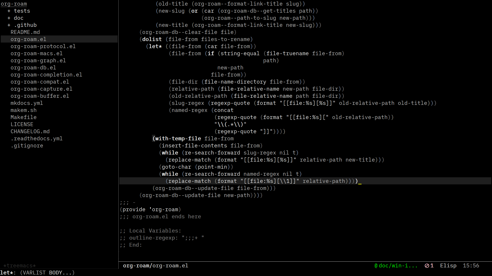

# less-theme

My `less-theme` is an adaptation of the [theme of the same name](https://jblevins.org/projects/emacs-color-themes/) by [Jason Blevins](https://jblevins.org/projects/emacs-color-themes/), author of `markdown-mode` and `deft` (both of which I use daily).

It is hugely influenced by the aethetics of the clean UI seen in the works of [William Rankin (rnkn)](https://github.com/rnkn): [e.g. Binder](https://github.com/rnkn/binder)

Omission of conventional syntax highlighting is intentional. I am encouraged especially by the following trailblazers:

- [No Frils (AKA: Syntax Highlighting
Off)](https://www.robertmelton.com/posts/syntax-highlighting-off/) by Robert Melton. For some reason, I like it when Melton notes, "People on the internet will get very angry at you if you tell them you don’t like syntax highlighting. VERY ANGRY" -- you know you are a minority. 

- I got to know Melton's post via Gergely Nagy,[Emacs `brutalist-theme` author](https://asylum.madhouse-project.org/blog/2018/09/06/the-brutalist-path/).
